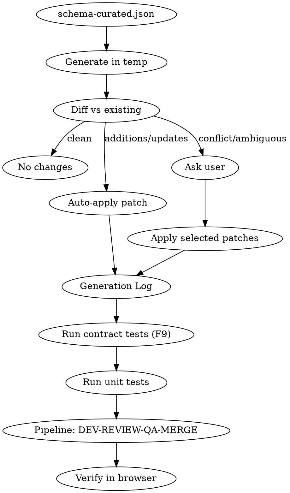

# Schema Forge UI Generation Pipeline

## Overview

Generate contract + frontend from schema-curated.json using a temp-diff-patch flow. Clean diffs auto-apply; ambiguous changes prompt the user. Always runs through the team pipeline (DEV-REVIEW-QA-MERGE).

## Flow



## Step 1: Worktree Isolation (MANDATORY)

```bash
git worktree add .worktrees/feat-<name> -b feat/<name>
```

ALL work happens in the worktree. Never modify main directly.

## Step 2: Generate Contract + Frontend

```bash
WINDOW="<window-name>"

# F6: Generate contract
node cli/src/generate-contract.js \
  artifacts/$WINDOW/schema-curated.json \
  artifacts/$WINDOW/rules-curated.json

# F8: Generate frontend
node cli/src/generate-frontend.js \
  artifacts/$WINDOW/contract.json
```

Output in `artifacts/{window}/generated/web/{window}/`:
- `*Table.jsx` -- declarative column config imports `DataTable`
- `*Form.jsx` -- declarative field config imports `EntityForm`
- `*Page.jsx` -- `MasterDetailPage` (if detail entity) or `SingleEntityPage`
- `index.jsx` -- entry point
- `mockCatalogs.js` -- reference data for FK fields
- `mockData.js` -- sample records (manual, not auto-generated)

## Step 3: Diff and Patch

```bash
git diff artifacts/$WINDOW/
```

| Diff type | Action |
|-----------|--------|
| New files only | Auto-apply |
| Field added/removed | Auto-apply |
| Type changed (string to boolean) | Auto-apply |
| Component structure changed | Review diff, ask user if unclear |
| mockData.js changed | SKIP -- manually curated |
| Hand-edited file overwritten | ASK user -- show diff |

## Step 4: Generation Log

```bash
node cli/src/generation-log.js <window-name> "<trigger-description>"
```

This diffs current files (disk) vs previous (git HEAD), appends to `artifacts/generation-log.json`, and generates:
- Per-window: `artifacts/{window}/GENERATION-LOG.md`
- Transversal: `artifacts/GENERATION-RUNS.md`

## Step 5: Run Tests

```bash
# F9: Contract tests
node -e "
import { runContractTests } from './cli/src/run-contract-tests.js';
import { readFileSync } from 'node:fs';
const c = JSON.parse(readFileSync('artifacts/$WINDOW/contract.json','utf8'));
const r = runContractTests(c);
console.log(r.passed+'/'+r.total+' passed');
if(r.failed>0) process.exit(1);
"

# Unit tests
node --test 'cli/test/*.test.js'
```

## Step 6: Pipeline (DEV-REVIEW-QA-MERGE)

1. Commit in worktree
2. Push: `git push -u origin feat/<name>`
3. PR: `gh pr create --title "..." --body "..."`
4. REVIEW (Alex agent): comment verdict on PR
5. QA (Sentinel agent): tests + artifact regeneration check
6. MERGE: `gh pr merge <n> --squash`
7. Cleanup: remove worktree, delete branch, pull main

## Step 7: Verify in Browser

Dev server at localhost:3102. Use chrome-devtools MCP to reload, navigate, screenshot, verify CRUD.

## Entity Patterns

**Single Entity** (Warehouse, Tax, UOM, etc.): ONE entity in schema, generates `SingleEntityPage`.

**Master-Detail** (Sales Order to Lines, BP to Locations, PriceList to Lines): TWO entities, generates `MasterDetailPage`. Child entity must have system field with `derivation.type: "fromParent"`.

## Field Type Mapping

| Schema type | Table column | Form input |
|-------------|-------------|------------|
| string | string | text |
| number/integer | number | number |
| amount | amount | number |
| date | date | date |
| boolean | boolean (Yes/No) | checkbox |
| foreignKey + search | -- | search (autocomplete) |
| foreignKey + selector | -- | selector (dropdown) |
| foreignKey + dependent | -- | dependent (filtered dropdown) |

## FK inputMode Rules

| Cardinality | inputMode | Component |
|-------------|-----------|-----------|
| Many records (BP, Product) | search | SearchInput |
| Few records (Warehouse, Tax) | selector | SelectorInput |
| Filtered by parent | dependent | DependentSelect |

Dependent fields need `dependsOn: { field: "parentKey", filterKey: "parentIdColumn" }`.

## Schema Constraints (INVIOLABLE)

- Only `visibility: editable` or `readOnly` in UI
- System fields NEVER in UI
- Only `searchable: true` fields become filters
- `grid: true` appears in table, `form: true` in edit form
- FK `reference` must match a catalog entity

## Multi-Window Registration

When adding a window, update:
1. `tools/app-shell/src/windows/registry.js` -- windowLoaders + REFERENCE_WINDOWS
2. `tools/app-shell/src/App.jsx` -- mockData import
3. Verify `@generated` alias in vite.config.js

## Regenerate All Entities

After generator changes:

```bash
for dir in sales-order business-partner warehouse price-list payment-term \
           payment-method product tax uom user; do
  node cli/src/generate-contract.js "artifacts/$dir/schema-curated.json" \
    "artifacts/$dir/rules-curated.json"
  node cli/src/generate-frontend.js "artifacts/$dir/contract.json"
  node cli/src/generation-log.js "$dir" "<trigger>"
done
```

## Pixel Agents Notification

```bash
echo '{"session":"schema-forge","from":"Forge","text":"<msg>","ts":"'$(date -u +%Y-%m-%dT%H:%M:%SZ)'"}' >> ~/.pixel-agents/chat.jsonl
```

Notify on: DEV complete, REVIEW verdict, QA verdict, PR merged.
