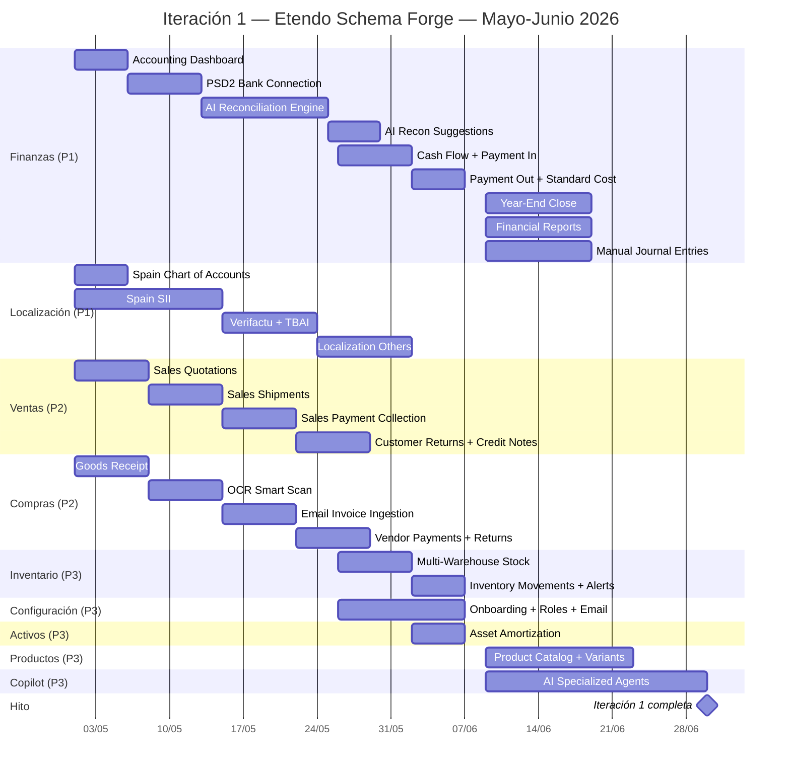
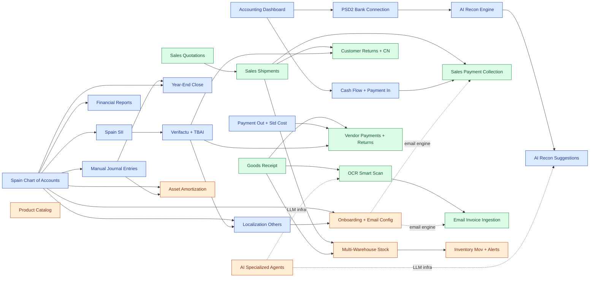

# Gantt + Árbol de requerimientos — Iteración 1 (Mayo–Junio 2026)

Vista temporal y de dependencias derivada de los TASKS por tema.
Fuente original: `gantt-etendo-mayo-junio-2026.xlsx`.
Este documento es la **vista canónica**; cada barra/nodo enlaza con su `.md` detallado.

## Calendario de referencia

| Semana | Rango | Notas |
|--------|-------|-------|
| S1 | 01/05 → 05/05 | Día festivo 01/05 (España) |
| S2 | 06/05 → 11/05 | |
| S3 | 12/05 → 18/05 | |
| S4 | 19/05 → 25/05 | |
| S5 | 26/05 → 01/06 | |
| S6 | 02/06 → 08/06 | |
| post-S6 | 09/06 → 30/06 | Cierre Iteración 1 |

## Gantt — Timeline



## Árbol de requerimientos (dependencias)

Las flechas sólidas son **bloqueos duros** (la tarea destino no puede empezar hasta que la origen termine). Las punteadas son **integraciones blandas** (consume servicio/infra de la otra pero puede empezar en paralelo).



## Camino crítico

El **camino crítico** (la cadena de tareas más larga que define la fecha de cierre de la iteración) es:

```
Spain Chart of Accounts (S1)
  → Spain SII (S1-S3)
  → Verifactu + TBAI (S3-S4)
  → Localization Others (S4-S5)
  → Onboarding + Roles + Email (S5-S6)
```

Y en paralelo, otra cadena casi tan larga del lado de Finanzas:

```
Accounting Dashboard (S1-S2)
  → PSD2 Connection (S2-S3)
  → AI Reconciliation Engine (S3-S5)
  → AI Reconciliation Suggestions (S5-S6)
```

## Dependencias entre temas (resumen)

| Tema | Bloquea a | Bloqueado por |
|------|-----------|---------------|
| Localización | Finanzas (reportes, cierre, asientos), Ventas (CN), Compras (CN), Configuración | — |
| Finanzas | Ventas (cobros), Compras (pagos), Activos | Localización |
| Ventas | Inventario (multi-warehouse) | Finanzas, Localización |
| Compras | Inventario (multi-warehouse), Copilot consume OCR | Finanzas, Localización |
| Inventario | — | Ventas, Compras |
| Activos | — | Localización, Finanzas |
| Configuración | Email engine de Ventas / Compras | Localización |
| Productos | — | (independiente; idealmente antes de tarifas en Ventas) |
| Copilot | OCR y AI Recon | (independiente) |

## Riesgos del cronograma

- **SII está en el camino crítico**. Cualquier slip en SII bloquea Verifactu+TBAI y la base de localización para otros países. Tener el certificado digital del cliente disponible en S1 es prerequisito no negociable.
- **AI Reconciliation Engine es la tarea más larga (12 días)**. Empezar el diseño en S1 mientras Dev A todavía trabaja en el dashboard reduce riesgo.
- **Onboarding (Configuración)** depende de Localization Others; si Dev B se atrasa con la abstracción de packs, Onboarding se rompe.
- **OCR Smart Scan** depende de la infra de Copilot, pero Copilot está planificada para post-S6. Solución: implementar el cliente LLM ad-hoc en OCR primero, refactorizar a `AgentRegistry` cuando Copilot aterrice.
- **Wizard layout** (necesario para Year-End Close y Onboarding) NO existe en el generador hoy. Es un prerequisito de Schema Forge Developer que debería arrancar en abril/inicio de mayo.

## Enlaces a las tareas

Cada barra del Gantt y cada nodo del árbol corresponden a un `.md` detallado:

- Finanzas: [accounting-dashboard](./finanzas/accounting-dashboard.md) · [psd2-bank-connection](./finanzas/psd2-bank-connection.md) · [ai-reconciliation-engine](./finanzas/ai-reconciliation-engine.md) · [ai-reconciliation-suggestions](./finanzas/ai-reconciliation-suggestions.md) · [cash-flow-payment-in](./finanzas/cash-flow-payment-in.md) · [payment-out-standard-cost](./finanzas/payment-out-standard-cost.md) · [year-end-close](./finanzas/year-end-close.md) · [financial-reports](./finanzas/financial-reports.md) · [manual-journal-entries](./finanzas/manual-journal-entries.md)
- Localización: [chart-of-accounts-spain](./localizacion/chart-of-accounts-spain.md) · [sii-spain](./localizacion/sii-spain.md) · [verifactu-tbai](./localizacion/verifactu-tbai.md) · [localization-others](./localizacion/localization-others.md)
- Ventas: [quotations](./ventas/quotations.md) · [sales-shipments](./ventas/sales-shipments.md) · [sales-payment-collection](./ventas/sales-payment-collection.md) · [customer-returns-credit-notes](./ventas/customer-returns-credit-notes.md)
- Compras: [goods-receipt-flow](./compras/goods-receipt-flow.md) · [ocr-smart-scan](./compras/ocr-smart-scan.md) · [email-invoice-ingestion](./compras/email-invoice-ingestion.md) · [vendor-payments-returns](./compras/vendor-payments-returns.md)
- Inventario: [multi-warehouse-stock](./inventario/multi-warehouse-stock.md) · [inventory-movements-alerts](./inventario/inventory-movements-alerts.md)
- Productos: [product-catalog-variants-pricing](./productos/product-catalog-variants-pricing.md)
- Activos: [asset-amortization](./activos/asset-amortization.md)
- Copilot: [ai-specialized-agents](./copilot/ai-specialized-agents.md)
- Configuración: [onboarding-roles-email](./configuracion/onboarding-roles-email.md)
